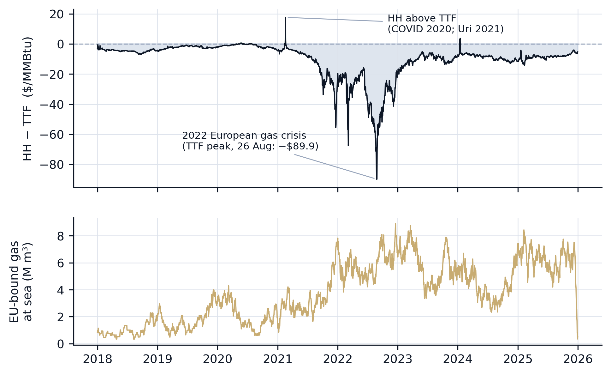
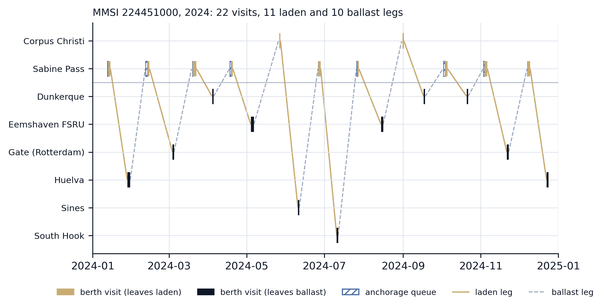
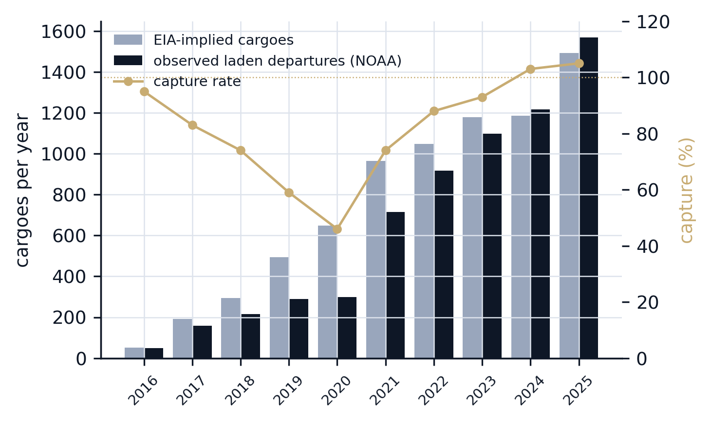
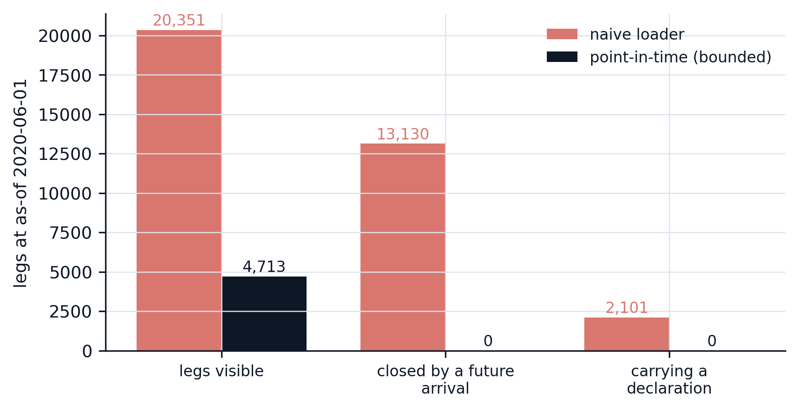
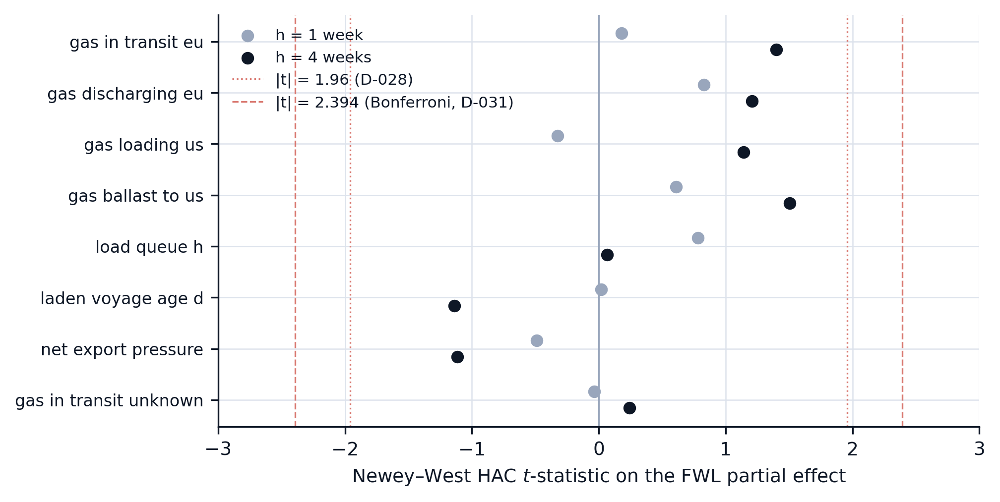

# tanker-flow

**Does public vessel-tracking data predict the Henry Hub–TTF gas spread?**

No. This repo is the pipeline built to investigate that question properly.

A laden LNG carrier leaving Sabine Pass reaches Rotterdam in fourteen to eighteen
days. For that whole crossing the cargo is committed, visible to anyone with an AIS
receiver, and absent from every published supply statistic. So it is natural to
expect vessel positions to lead the transatlantic gas spread, and there is a
commercial data industry built on that belief. I tested it on a decade of public
data and found nothing.

The full write-up is **[`paper/main.pdf`](paper/main.pdf)** ("Public vessel-tracking
data does not predict the Henry Hub–TTF spread: a pre-registered, power-bounded
null"), rebuildable with `make paper`. What follows is the shorter, summary version.



*The target (top) and the headline signal (bottom). The stock of Europe-bound gas
at sea is reconstructed entirely from vessel positions. The cliff at the right edge
is a coverage seam where the archives end and the live feed begins. It is excluded
from the primary sample; how it was found is described below.*

---

## What got built

To ask the question at all, I first had to reconstruct where the gas was.

| | |
|---|---|
| AIS position fixes | **54,494,686** (2016-01-01 → 2026-08-10) |
| Port events reconstructed | **87,874** |
| LNG terminals covered | **40**, across 7 US and European zones |
| Berth / anchorage / approach polygons | **142**, hand-drawn in QGIS |
| Vessels tracked | **828** LNG carriers and FSRUs (the world fleet) |
| Daily signals | **34 keys**, 1,032,982 panel rows, each built twice |
| Tests | **591** |

Three feeds go in: a real-time AISstream WebSocket, NOAA's Marine Cadastre archive
(US, decade-deep), and Global Fishing Watch port visits (global, coarser). Raw
positions become port events via a per-vessel state machine walking each fix against
the polygons; port events pair into voyage legs, berth visits and anchorage queues;
those aggregate into the daily signal panel.

```
IGU fleet report  ─► scripts/import_igu_fleet.py ─► vessel_registry   (~828 LNG/FSRU vessels)
ais_fixes+state   ─► pipeline/scoring.py ────────► priority_watchlist (5-tier ranking, hourly)
                                                     │
priority_watchlist ► ingestion/aisstream.py ──────► ais_fixes         (TimescaleDB hypertable)
VesselFinder API  ─► ingestion/vf_rescue.py ─────► ais_fixes          (credit-budgeted gap backstop)
NOAA / GFW        ─► ingestion/historical/* ─────► ais_fixes / port_events   (decade backfill)

ais_fixes         ─► pipeline/port_events.py ────► port_events        (per-vessel state machine)
port_events       ─►┬─ pipeline/legs.py     (at-sea voyages)
                    ├─ pipeline/visits.py   (berth occupancy)
                    └─ pipeline/queues.py   (anchorage waits)
                          └────────────────► pipeline/signal.py ─► signal_daily   (34 signals, dual-basis)

EIA / FRED / GIE / Open-Meteo / Yahoo ──► data/{eia,market}.py ─► eia_series, market_series
signal_daily + market_series ──────────► data/model_panel.py ──► model_panel      (the modelling grid)
```

One vessel's year, straight out of the reconstruction: the Gulf-to-Europe shuttle,
laden out and ballast back, with berth visits and anchorage queues.



### The live acquisition problem

Most of the engineering went here. AISstream allows three concurrent connections of
fifty MMSIs each: **150 subscription slots for a fleet of 828**. So the ingester runs
a scoring layer that ranks every vessel hourly by how likely it is to produce a
signal-defining event soon (in a terminal polygon, declaring an imminent arrival,
closing on a zone) and reallocates slots on a one-hour cycle, with a scan rotation
that prevents low-tier vessels from starving.

When a vessel still goes dark near a terminal, a second worker buys its position
back from VesselFinder one credit at a time and injects it as a normal fix. That
budget is a fixed reserve which **expires unused**, so the policy is to hit zero
exactly at expiry rather than to minimise spend: the daily cap is derived each run
from the live balance and days remaining, priority classes are exempt from it,
lower-value classes spend only the surplus above the glide line, and every request
the budget could not serve is logged so unmet demand stays measurable.

---

## Is the reconstruction real?

Before trusting any of it, check it against a published total. Per month, observed
laden departures from US export terminals ÷ EIA's reported export volume converted
to cargoes:



Capture runs **46% in 2020 and 105% in 2025**. That gradient is receiver density
growing over the decade, not a pipeline bug, and it is a real limitation: early-year
levels of every US signal are biased low. GFW's coverage runs the *other* way over
the same years, so neither archive is complete on its own and the union is not their
sum. The walk-forward tests operate on within-window changes, which is some defence,
but a level-dependent effect in the early years would be misread.

---

## Two ways a voyage feature leaks, and both are the default

A voyage is the natural unit of observation, and **it does not exist until both of
its endpoints have been observed**. So any statistic computed over completed voyages
embeds the future unless you explicitly bound the population. At a 2020 as-of date,
a straightforward loader returned 20,351 legs, of which **13,130 (65%) had been
closed by arrivals that had not happened yet.**

The second is subtler. The same loader attached 2,101 destination declarations
to 2020 voyages from a data feed that only began in 2026. A date filter on rows does
not catch this, because every individual row is correctly dated. The *table* should
not exist at that vintage.



Neither was a bug anyone wrote on purpose; both are what the natural implementation
does. So every signal in the panel is built twice: a `physical` basis with full
hindsight for validation, and a `knowable` basis that is strictly point-in-time and
is the only one the models see. The live pipeline also logs each day's values
as-printed, so the knowable series can be checked against what was actually knowable.

---

## Part A: can the signals predict the physical thing they measure?

Before touching a price, ask whether the pipeline predicts quantities it observes
directly (weekly EU arrivals, weekly US loadings, terminal outages) against two
naive nulls: last week's count, and the trailing four-week mean. Four models,
pre-registered, scored walk-forward. Excess error over the four-week mean, where
positive is *worse* than the null:

| Model | What it is | Excess MAE vs the 4-week mean |
|---|---|---|
| A1 | duration climatology, no fitted parameter | +27.5% |
| A2 | negative-binomial count GLM | +84.0% |
| A4 | Kalman local level | **+0.7%** |

A fourth, A5, detects terminal outages by Bayesian online changepoint detection and
is beaten by its own null. All four fail, but the pattern is informative: they
approach the moving average from above without crossing it, and A4, the one with a
fitted smoothing constant, chose a **seven-week effective window by maximum
likelihood**, landing within a percent of the four-week mean. For a slow industrial
flow that behaves like a local level plus noise, the exponentially weighted mean is
the optimal linear predictor, so A4's result is that theory confirmed rather than a
modelling failure, and it is a reason not to expect a richer model to beat a moving
average on a series like this.

Two things did survive Part A: A5's *null* (a rate-relative silence rule) is a
usable outage monitor at **38% recall (6 of 16 labelled outages), a 12-day median
detection delay and 0.19 false alarms per terminal-year**, and A2 confirmed that
berth occupancy and queue depth enter the loadings model with the right sign in 100%
of weeks.

---

## Part B: can they predict the price?

The target is the Henry Hub–TTF spread in $/MMBtu (TTF converted at the day's FX
rate *before* differencing, or the exchange rate leaks into the target as a spurious
signal), sampled weekly, scored on the 1- and 4-week-ahead change. Controls: the
spread's own persistence, US and NW-European degree days, US and EU storage, Brent,
a winter dummy. Everything walk-forward, training rows purged where their target
window straddles the test week, all standard errors Newey–West with the lag fixed in
advance.

**First result: the controls-only model is worse than assuming no change**, by −9.3%
at one week and −18.2% at four. So a random walk is the operative null, and the
spread behaves like one at these horizons.

**Second result: no tanker signal survives the controls.** Frisch–Waugh–Lovell
partial effects, every signal against the residual:



Largest |t| anywhere is **1.50** against a 1.96 bar. Largest partial R² is **0.009**.

**Third: three pre-registered mechanisms a linear scan could miss also fail.** The
Europe-bound *share* of at-sea cargo rather than its level (H2); an interaction with
EU storage, on the theory that cargo matters more when Europe is short (H3); and an
observable tightness-regime split (H4). Each was written down with its sign, held to
a Bonferroni bar of |t| > 2.394, and required to replicate on a 2025+ holdout that
was not looked at until it had passed on discovery. Largest |t| across the three:
**0.89**. Each fails in a specific way rather than merely quietly: H3 comes out with
the *wrong sign* against a bar it never approaches, and H4's "tight" regime effect is
smaller in magnitude than its loose one, the reverse of what it predicted.

### How big an effect could this have found?

A null needs this number. With the weekly sample available, the design detects
effects explaining at least **1.72% of residual variance**. The largest effect
observed anywhere is **0.9%**.

So this excludes effects large enough to trade on, and says nothing about smaller
ones.

---

## What survives

The null is what an efficient market predicts, and I want to be precise about which
question was actually asked. These signals come from public terrestrial AIS and a
free voyage archive: a coarser version of what a gas desk already buys, reaching a
public researcher on a delay a desk would find unusable. The test was never "is the
physical signal informative"; it was "is *public* physical data mispriced in a liquid
benchmark at one to four weeks". A no there is close to expected.

What the work adds is that the no is not an artefact of a broken pipeline, an unlucky
specification, or a search that stopped at the first t > 2. The reconstruction
reconciles with a published total, the specification was fixed before the fit, and
the search was multiplicity-corrected and held out.

And independently of the price result:

- **A decade-scale port-event reconstruction with a measured capture rate**, built
  point-in-time and validated against its own live prints.
- **Two construction hazards** specific to voyage-derived features, both of which are
  what the default implementation does, and both cheap to detect once you know to
  look.
- **A physical-nowcast benchmark** establishing that the naive mean is near-optimal
  for weekly loadings, with the reason.
- **An outage monitor** with a stated recall and delay.
- **A coverage seam found by a plot, not a test.** A 91% fall in the at-sea stock at
  the turn of 2026 passed a 70-check validation sweep and 591 tests. It was visible
  in the first figure I drew for the paper. There is now an open item to make a
  coverage-regime break fail a check rather than a plot.
- **A falsified pre-registered sign**, reported as falsified: ballast arrivals enter
  the loadings model with a stable *negative* coefficient against a prior of positive.

Recorded as unresolved rather than explained: nearly half of matured laden departures
never pair with a European arrival at all. They pair with the vessel's return to the
Gulf, median about a month. Those are cargoes whose destination the public feeds
never saw, and the reason the arrival model cannot assume that a leg still open is
still Europe-bound. Between 75% and 83% of the at-sea stock has no resolved
destination.

---

## What would change the answer

Satellite coverage or a proprietary destination model would change the *question*
into a test of a vendor's product. Within public data, the most promising unexplored
feature is geometric: a Gulf cargo bound for Europe must exit north-east through the
Straits of Florida while Asia-bound cargoes route south. The project's notes record
a north-east crossing as strong evidence of a European arrival about thirteen days
out. The crossing is inside terrestrial AIS range, so this is a coverage question,
and the live system's slot allocation was changed to hold departing vessels through
the Straits, but the decade archives do not carry it, so it is untested here.

Beyond that: a deduplicated NOAA+GFW union with the residual under-count carried as
an EIA-calibrated exposure offset (which would recover the early years as levels, not
just changes); joint rather than marginal fits over the collinear signal block;
distributed lags; the 26 signal keys the panel does not use. Each has a weaker prior
than the three mechanisms already tested and faces a larger multiplicity problem
against a residual that has never exceeded 0.9% of variance. Any of them should
arrive with its own pre-registration, correction and untouched holdout.

---

## Reproducing it

Every number in the paper is generated; nothing is typed by hand. A number without a
generated macro behind it does not compile.

```bash
make signals        # rebuild the 34-signal panel from port events
make model-panel    # assemble the spread + controls + signals grid

make a1-replay      # Part A: arrival-count baseline
make a2-replay      #         count GLM
make a4-replay      #         Kalman local level
make a5-replay      #         outage detection
make b0-coverage    # Part B: AR(1)+controls null and the FWL scan
make mechanisms-coverage   #  H2/H3/H4, Bonferroni + holdout

make paper          # results → tables → figures → PDF
```

The append-only decision log in **[`analysis/DECISIONS.md`](analysis/DECISIONS.md)**
is the pre-registration record: every target, control set, lag, sign and acceptance
bar was written there before the corresponding fit, and where a sign was falsified it
is recorded as falsified. The log's honest limitation is stated in the paper: the git
history does not independently establish that each entry preceded the fit it governs.

## Running the pipeline

```bash
# Database (TimescaleDB + PostGIS in Docker)
make up / make down / make psql
make reset                    # DESTRUCTIVE: wipe and recreate from db/init/schema.sql

# Seeding
make seed-terminals seed-zones seed-unlocodes

# Live ingestion
make ingest                   # AIS WebSocket ingester (foreground)
make enrich                   # VesselFinder masterdata (terminal-scoped by default)
make vf-rescue-dry            # preview the credit-budgeted gap backstop, no spend
make discover-dry             # preview newbuild discovery, no spend

# Historical backfill
make backfill-noaa backfill-gfw reconcile

# Derived tables
make port-events scoring signals
make market model-panel
make capture-rate             # validate the reconstruction against EIA

# Monitoring
make viz                      # FastAPI: map, signals and pipeline-health views at :8000
```

Needs a `.env` with `DB_*` and `AISSTREAM_API_KEY`; `VF_API_KEY`, `EIA_API_KEY`,
`FRED_API_KEY` and `GIE_AGSI_API_KEY` each degrade to a skip when absent. Every
variable must be declared on `Settings` in `config.py`, because `pydantic-settings`
forbids extras, so an undeclared key breaks every entry point at import.

## Repo map

| Path | What is in it |
|---|---|
| [`CLAUDE.md`](CLAUDE.md) | The living architecture spec: full schema, every module, every design call |
| [`analysis/DECISIONS.md`](analysis/DECISIONS.md) | Append-only pre-registration and results log |
| [`analysis/SIGNALS.md`](analysis/SIGNALS.md) | The 34-signal catalogue: definition, construction, rationale |
| [`analysis/MODELS.md`](analysis/MODELS.md) | Model specifications for Parts A and B |
| [`analysis/VALIDATION.md`](analysis/VALIDATION.md) | The validation sweep and what it does and does not catch |
| [`ingestion/`](ingestion/) | AIS ingester, enrichment, credit-budgeted rescue ([README](ingestion/README.md)) |
| [`pipeline/`](pipeline/) | State machine, legs / visits / queues, signal aggregation, scoring |
| [`data/`](data/) | External series (EIA, market controls), model panel, capture rate |
| [`analysis/`](analysis/) | Model implementations and replay harnesses |
| [`paper/`](paper/) | The write-up, its generators, figures and machine-readable results |
| [`qgis/`](qgis/) | Terminal zone polygons and how to draw them ([README](qgis/README.md)) |
| [`viz/`](viz/) | FastAPI + Leaflet: map, signals and pipeline-health views |

## Stack

TimescaleDB (PostgreSQL + PostGIS) on Docker · Python with asyncpg / websockets /
httpx / pandas / statsmodels · pydantic-settings · QGIS for the polygons · FastAPI +
Leaflet + Chart.js for the viz · uv · pytest · ruff.

---

## How this was built

I built tanker-flow with AI assistance (Claude Code) as a deliberate part of the
workflow, and I would rather show that than hide it. Directing AI well to produce a
correct, non-trivial system is part of the skillset, not a shortcut around it.

**What is mine:** the architecture, the domain model (the port-event state machine,
the dual-basis signal, the credit-budgeted rescue backstop), and every hypothesis,
sign, acceptance bar and consequential tradeoff. AI accelerated implementation,
refactors and data exploration under that direction.

**How it is kept honest:**

- **Design-doc-first.** `CLAUDE.md` is the living spec the assistant and any reader
  both work from.
- **Pre-registration.** `analysis/DECISIONS.md` is append-only and dated. Hypotheses
  and bars go in before the fit; falsified signs are recorded as falsified.
- **Audit-before-build.** [`docs/pipeline-health.md`](docs/pipeline-health.md) is
  an append-only check-up log: a dated read-only sweep of ingestion mechanics, event
  integrity and derived-signal sanity, run before trusting a change.
- **Verify, do not trust.** Findings are checked against live query output. Every
  number in the paper is generated from a machine-readable result, and one that is
  not cannot appear in the text.

Every line is one I can explain and defend.
